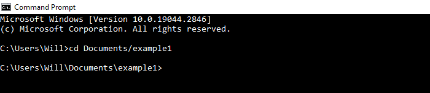
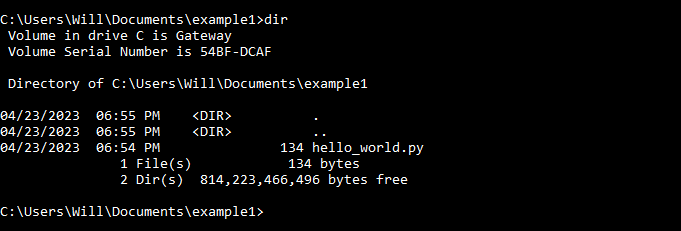
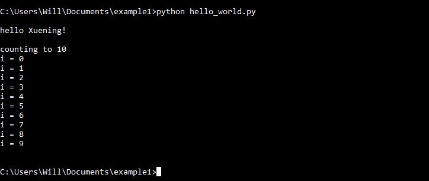

## Example1: run hello_world.py from the command line.

1. Copy hello_world.py file to a directory on your computer. In the example
   below we put hello_word.py into the a directory called example in
   Documents.  

2. Open console (command prompt) and change directory using the "cd" command so
   that this directory containing hello_world.py is the current directory as
   shown below. 

3. You can list the contents of the current directory using the "dir" command.  
   You should see the hello_world.py file in the output as shown below. 

4. Run the "hello_world.py" program by entering "python hello_world.py" on the
   command line. The output should look like that shown below. 

