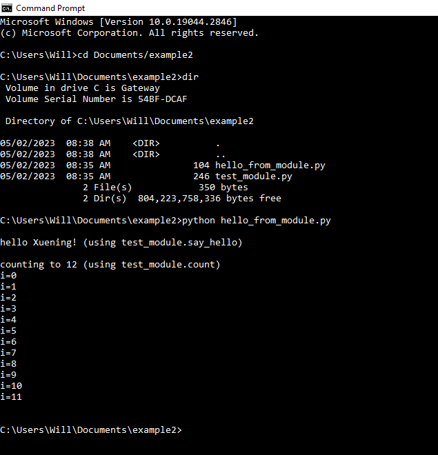

## Example1: run hello_from_module.py from the command line. 

The hello_from_module.py program imports the test_module.py python modules and
calls the say_hello and count functions defined in that module.

1. Copy the hello_from_module.py and test_module.py files to a directory on
   your computer. In the example below we put them into the a directory called
   "example2" in Documents.  

2. Open the windows command prompt (command line) and change directory using
   the "cd" command so that the directory containing hello_from_module.py and 
   test_module.py files is the current directory. 

3. Check that both files are in the current directory using the "dir" command as
   shown in example1. 

4. Run the "hello_from_module.py" program by entering "python hello_world.py"
   on the command line from the example2 directory. The output should look like
   that shown below. 

#

